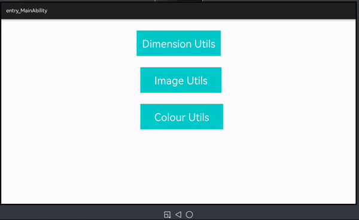

# OHOSUtils

A OHOSUtils library is collection of utils classes which is created for the dependencies used in SlideActionView library for implementation, but feel free to add your own contributions as you wish.

## Source
Inspired by [fennifith/AndroidUtils](https://github.com/fennifith/AndroidUtils) - version 0.0.1

## Feature
This library provides the collection of utils classes.


## Dependency
1. For using OHOSUtil module in sample app, include the source code and add the below dependencies in entry/build.gradle to generate hap/support.har.
```groovy
dependencies {
        implementation fileTree(dir: 'libs', include: ['*.jar', '*.har'])
        testImplementation 'junit:junit:4.13'
        ohosTestImplementation 'com.huawei.ohos.testkit:runner:1.0.0.100'
        implementation project(':ohosutils')
    }
```
2. For using OHOSUtils in separate application using har file, add the har file in the entry/libs folder and add the dependencies in entry/build.gradle file.
```groovy
dependencies {
        implementation fileTree(dir: 'libs', include: ['*.jar'])
        testImplementation 'junit:junit:4.13'
    }
```
3. For using OHOSUtils from a remote repository in separate application, add the below dependencies in entry/build.gradle file.
``` groovy
dependencies {
        implementation 'dev.applibgroup:ohosutils:1.0.0'
        testCompile 'junit:junit:4.13'
    }
```


## Usage

#### DimenUtils

Includes some unit conversion functions that use getDeviceCapability() or getDefaultDisplay() to find the display density:

1. dpToPx(Float) : A value of the provided dp units returns value in Pixel.

2. spToPx(Float) : A value of the provided Sp units returns value in Pixel.

3. pxToDp(Int) : A value of the provided Pixel units returns value in Dp.

4. pxToSp(Int) : A value of the provided Pixel units returns value in Sp.

#### ImageUtils

Includes method which converts the drawable to PixelMap.

1. drawableToBitmap(Element) : Converts the input Element drawable to PixelMap.

####  ColorUtils

Includes some methods that calculate the darkness of color and determine opaque color which will be equivalent translucent color drawn on top of another color

1. isColorDark(int) : Determine if a input color is dark or light. 

2. getColorDarkness(int) : Calculates the darkness of a input color.

3. withBackground(int, int) : Calculates an opaque color that is equivalent to a translucent color drawn on top of another color.

4. getHsvColorWheelArr(float, float) : Determine the HSVColor of the color returning array.

## Future Work

1. Since there is no class in HarmonyOS similar to ClipDrawable and LayerDrawable, the SeekBarDrawable.java and SeekBarUtils.java are currently not implemented due to platform dependencies.

2. In DimenUtil, since currently StatusBarHeight and NavigationBarHeight cannot be set as identifiers, getStatusBarHeight and getNavigationBarHeight method are currently not implemented due to platform dependencies.

 